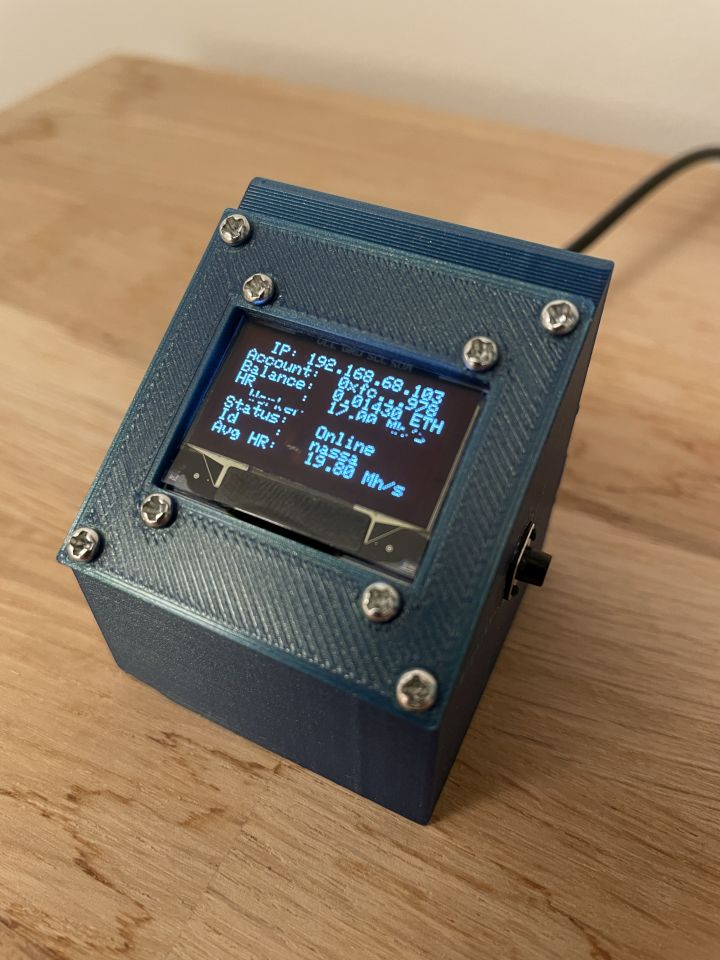
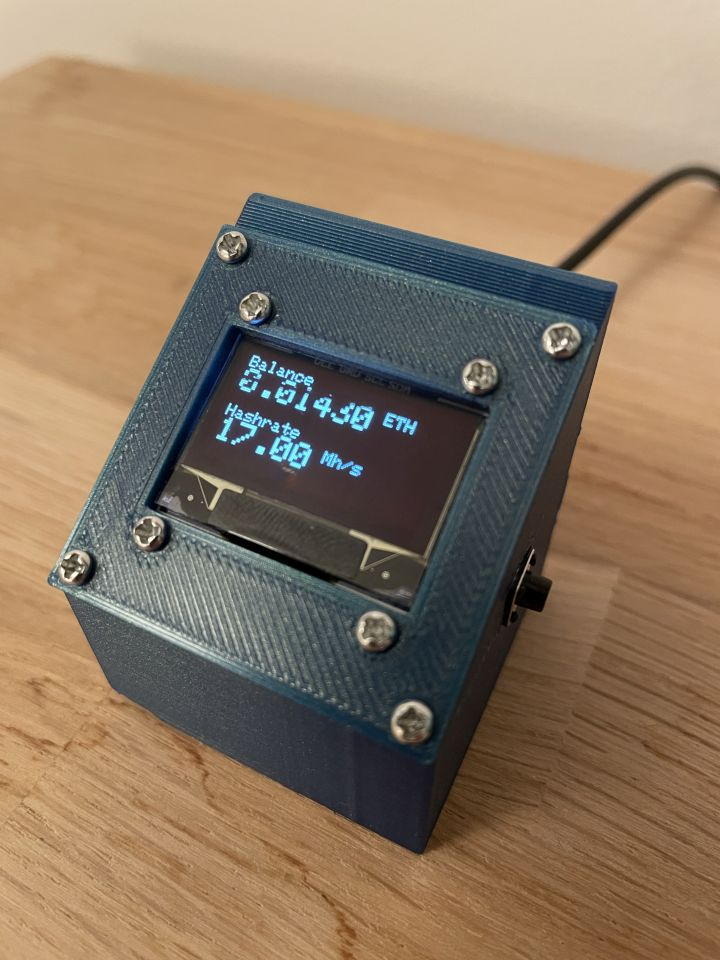
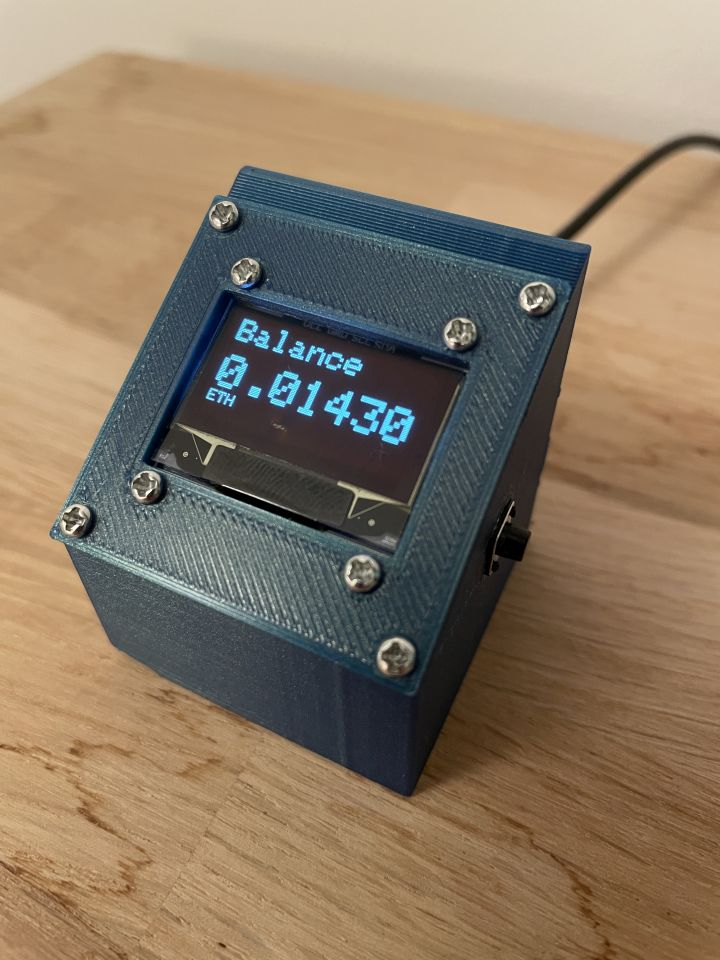
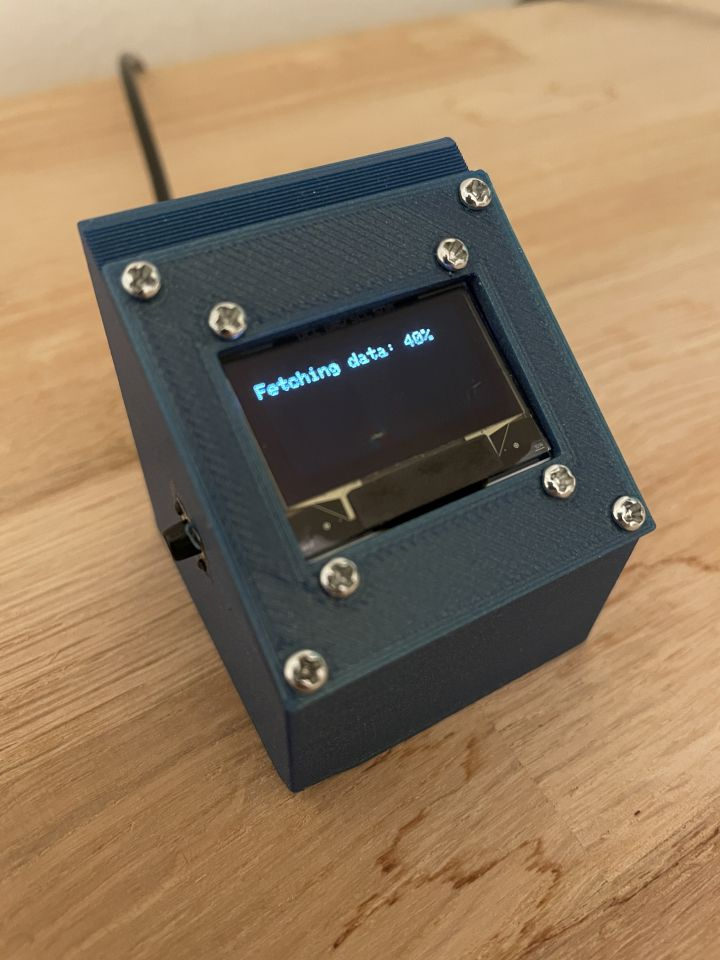
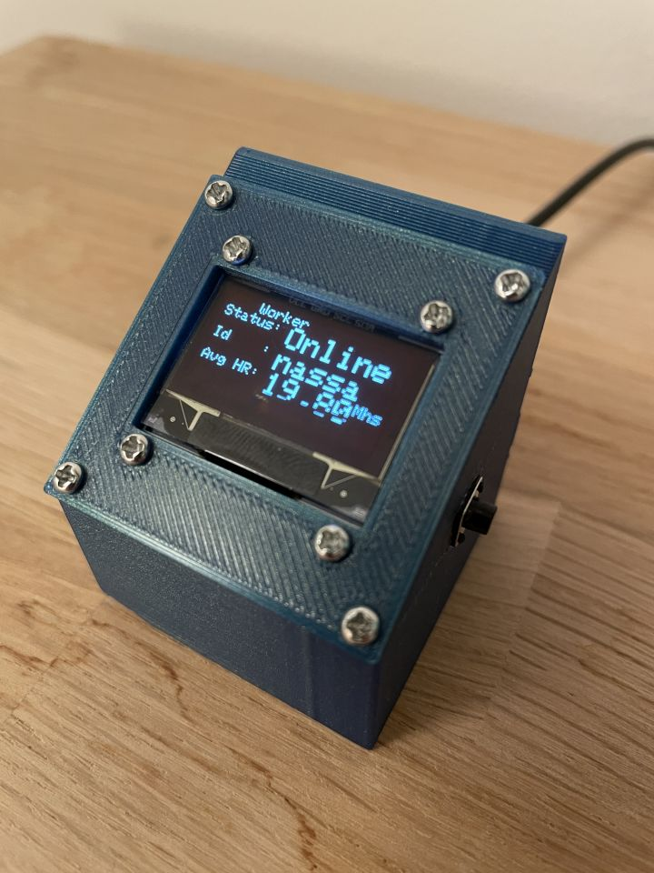
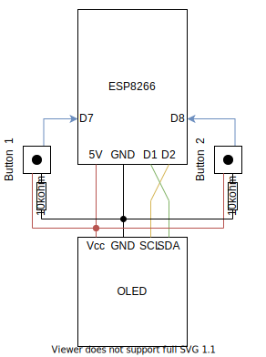

# Crypto plotter
This is a mini-project that monitors your crypto account and miner (worker).

## But why? :shrug:
As you easily can monitor your account and worker online, the real purpouse of the project was to learn about the ESP8266 and OLED module.

Using the ESP8266 and connecting to my local WiFi, I was able to fetch data from the [Nanopool API](https://eth.nanopool.org/api) and plot it on the OLED display. As the module can serve as a server I also used the data to display stats on the local servers webpage. I also added two buttons, one for changing how the data was displayed and one for making a new request for the API.

Having the luxury of owning a 3D printer, I designed a small case to fit both modules. Below is an image of the final result.

  
 


<div>
  <div class="column" style="float: left; width: 33.33%; padding: 5px; box-sizing: border-box;">
    
  </div>
  <div class="column" style="float: left; width: 33.33%; padding: 5px; box-sizing: border-box;">
    
  </div>
  <div class="column" style="float: left; width: 33.33%; padding: 5px; box-sizing: border-box;">
    
  </div>
</div>
<div>
  <div class="column" style="float: left; width: 33.33%; padding: 5px; box-sizing: border-box;">
    
  </div>
  <div class="column" style="float: left; width: 33.33%; padding: 5px; box-sizing: border-box;">
    
  </div>
</div>

## Content
1. [Requrements](#requrements)
    1. [Software](#software)
    2. [Hardware](#hardware)
2. [Circuit diagram](#circuit-diagram)
3. [Usage](#usage)
    1. [Debug](#debug)

## Requrements
### Software
- Arduino IDE >= v1.8.13

#### Library Manager
- ArduinoJson >= v6.17.3
- Adafruit GFX Library >= v1.10.6
- Adafruit SSD1306 >= v2.4.3

#### Board Manager
- esp8266 >= v2.7.4

### Hardware
- Wacom ESP8266 D1 mini
- OLED I2c IIC LCD Screen Module

## Circuit diagram


## Usage
There are a few variables that needs to be set befor building the code to the ESP8266.
```cpp
const char* ssid = "<your WiFi name";
const char* password = "<your WiFi password>";
const String accountId = "<your account ID>";
```
Also, keep in mind that your OLED module might need another `SCREEN_ADDRESS`. The default is `0x3C` for the 128x32 display.

After setting your variables you would need to connect your ESP8266 to the computer. In the IDE choose board `LOLIN(WEMOS) D1 R2 & mini`, keep the rest as default and select your `PORT`.

Upload the sketch and wait for it to fetch the data. The OLED and serial monitor will display the IP you can visit to check out the webpage.

> :sweat_smile: The `bootScreen()` is only there to make the device look interesting when booting. It basically waste like 5 seconds.

### Debug
After running the code you can see outputs in the serial monitor at baudrate `115200`.
